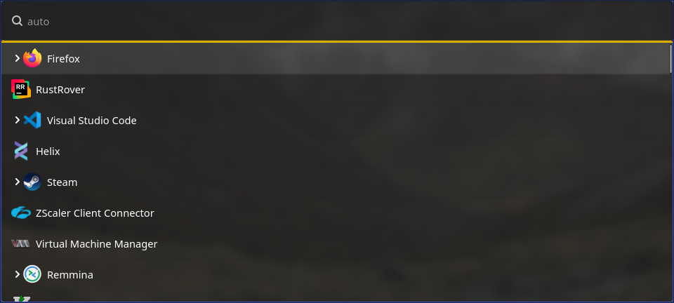

# Worf - Wayland Optimized Run Facilitator

Worf is yet another style launcher, heavily inspired by wofi, rofi and walker.
Worf is written in Rust on top of GTK4. 

It started out as a drop in replacement for wofi, so styles and config in most part (should) be compatible, 
with a few exception documented below. 
Worf has more features than wofi though, so there won't be 100% compatibility.

**While the main branch in general is stable and I am using this on a daily basis, it is not ready yet
to be used as a library, a lot of things are still moving around.**

It supports various modes:
* Math
* DRun
* File
* Ssh
* Run
* Emoji 
* // WebSearch
* Auto

Auto mode tries to detect the desired mode automatically, to achieve this some modes require a prefix in the search.
The standard view will show `ssh` and `drun`, for other modes the following prefixes are available:
* `ssh` (optional)
* `?` web search
* `/`, `$` or `~` for files


## Not finished
* [ ] key support
* [ ] full config support
* [ ] web search mode
* [ ] publish library


## Additional functionality compared to Wofi
* Support passing 'hidden' parameters that are not visible in the launcher but will be returned to the application
* Window switcher for hyprland
* All arguments expect show are supported by config and args

### New config / command line options
* fuzzy-length: Defines how long a string must be to be considered for fuzzy match
* row-box-orientation: Allows aligning values vertically to place the label below the icon

### New Styling options

## Styling

Styling names and classes are inspired by wofi, so most of the documentation and styling is the same

### Selectors

| name                    | description                                                   |
|-------------------------|---------------------------------------------------------------|
| `window`                | Entire main window.                                           |
| `outer-box`             | A box that everything else sits inside of.                    |
| `input`                 | Text box for filtering items.                                 |
| `scroll`                | Scrollable container that holds the `inner-box`.              |
| `inner-box`             | Box containing the menu entries.                              |
| `entry`                 | Box containing the text and optionally the image of an entry. |
| `text`                  | Name of the program/option displayed in an entry.             |
| `img`                   | Image displayed in an entry (optional).                       |
| `row`                   | Row containing the entry, used to control hover effects.      |
| `custom-key-label-text` | The label for custom keys                                     |
| `custom-key-label-box`  | Box containing the label, can be used for borders etc.        |
| `custom-key-hint-text`  | The label for custom keys hint                                |
| `custom-key-hint-box`   | Box containing the hint, can be used for borders etc.         |


Checkout more showcases in the [styles directory of this repo](styles).




## Setup

### Hyprland

Allow blur for Worf
```
layerrule = blur, worf
```


## Library

The launcher and UI can be used to build any launcher, as the ui, config and run logic is available as a separate crate.
This library is not available publicly yet as the interface is not stable enough.

## Wofi compatibility

### Breaking changes
* Runtime behaviour is not guaranteed to be the same and won't ever be, this includes error messages and themes.
* Themes in general are mostly compatible. Worf is using the same entity ids, 
  because worf is build on GTK4 instead of GTK3 there will be differences in the look and feel.
* Configuration files are not 100% compatible, Worf is using toml files instead, for most part this only means strings have to be quoted
* Color files are not supported
* `line_wrap` is now called `line-wrap`
* Wofi has a C-API, that is not and won't be supported, but Worf can be used as a rust library.

### Dropped arguments / config values
* `mode`, use show
* `dmenu`, use show
* `D`, arguments are the same as config in worf, no need to have this flag.
* `dark`, dark setting from theme is used now.
* `filter-rate`, worf is fast enough not to need this debounce

### Dropped configuration options
* stylesheet -> use style instead
* color / colors -> GTK4 does not support color files
