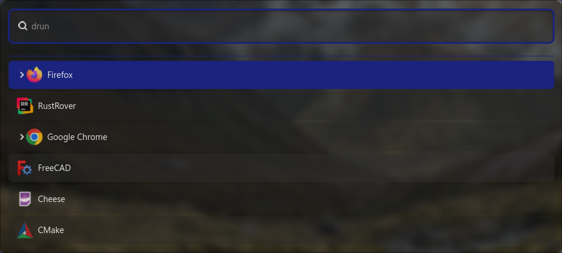

# 🚀 Worf - Wayland Optimized Run Facilitator

> 🎯 Application launcher for Wayland, written in Rust with GTK4

[](https://www.rust-lang.org/)
[](https://gtk.org/)
[](https://wayland.freedesktop.org/)
[](https://crates.io/crates/worf-launcher)
[](https://docs.rs/worf-launcher)

---

## ✨ Features

Worf is yet another style launcher, heavily inspired by **wofi**, **rofi**, and **walker**. Built from the ground up with Rust and GTK4, it offers exceptional performance and modern styling capabilities.

### 🎪 Multiple Modes Support

- 🧮 **Math** - Including binary/hex conversion and bitwise operations (`&`, `|`, `^`, `<<`, `>>`)
- 🚀 **DRun** - Desktop application launcher
- 📁 **File** - File browser and launcher
- 🖥️E **SSH** - Quick SSH connection launcher
- ⚡ **Run** - Command execution
- 😊 **Emoji** - Emoji picker
- 🔍 **Web Search** - Quick web searches
- 🤖 **Auto** - Intelligent mode detection

### 🧠 Smart Auto Mode

Auto mode intelligently detects what you're trying to do! Use these prefixes for quick access:

| Prefix        | Mode       | Description                          |
|---------------|------------|--------------------------------------|
| `ssh`         | SSH        | Connect to servers (optional prefix) |
| `?`           | Web Search | Search the web                       |
| `/`, `$`, `~` | Files      | Browse filesystem                    |


---

## 🎨 Styling & Theming

Styling is **wofi-compatible** with enhanced GTK4 features! Customize every aspect of your launcher.

### 🏷️ Available Selectors

| Selector                | Description                   |
|-------------------------|-------------------------------|
| `window`                | Main application window       |
| `outer-box`             | Container for all elements    |
| `input`                 | Search input field            |
| `scroll`                | Scrollable results container  |
| `inner-box`             | Menu entries container        |
| `entry`                 | Individual result entry       |
| `text`                  | Entry text content            |
| `img`                   | Entry icons                   |
| `row`                   | Entry row (for hover effects) |
| `custom-key-label-text` | Custom key labels             |
| `custom-key-label-box`  | Custom key label container    |
| `custom-key-hint-text`  | Custom key hints              |
| `custom-key-hint-box`   | Custom key hint container     |

---

## ⚙️ Setup

### ⚒️ Dependencies

* GTK4
* Wayland
* GTK4 layer shell

#### Arch

```bash
sudo pacman -S gtk4 gtk4-layer-shell
```

#### Ubuntu
Ubuntu does not ship gtk4-layer-shell in a supported version. 
Therefore it must be build manually

```bash
sudo apt install -y librust-gdk4-sys-dev \
    libglib2.0-dev libgtk-layer-shell-dev libgtk-layer-shell0 gir1.2-gtklayershell-0.1 \
    libgtk-4-dev gobject-introspection libgirepository1.0-dev gtk-doc-tools python3 valac \
    git cmake gcc meson ninja-build
    
cd /tmp
git clone https://github.com/wmww/gtk4-layer-shell
cd gtk4-layer-shell
meson setup -Dexamples=true -Ddocs=true -Dtests=true build
ninja -C build
sudo ninja -C build install
sudo ldconfig
```

#### Installing Worf

Install from crates.io (recommended):

```bash
cargo install worf-launcher
```

Or build from source if you need the latest code:

Before building, make sure you have the rust toolchain (at least 1.88) installed.
This is described here https://rustup.rs/

Then run the following commands to clone & build the application
```bash
git clone https://github.com/alexmohr/worf
cd worf
cargo build --release
```

You will find all worf binaries, including the examples, in `./target/release`.
Copy the binaries you need into a path that is part of `$PATH`, for example `/usr/bin`.
Installing via cargo (once available) will put the binaries in `$HOME/.cargo/bin`.


## Configuring Worf

Worf configuration files are looked up in the following directories
* Configuration file passed on the command line with `--conf`
* `$XDG_CONF_DIR/worf/config`
* `$HOME/.config/worf/config`

When no file is found, the defaults will be used.
Same is true for the style sheet, expect the filename will be `style.css`

All configuration options can also be set via the command line.

### Configuration options

This section describes all configuration options available for Worf, including their default values and usage. 
At the end, you will find a sample TOML configuration with all options set to their defaults.
All configuration options can also be set on the command line. Run `worf --help` for details.
The command line options have precedence over the configuration file.


| Option                        | Type             | Default Value                | Description                                                    |
|-------------------------------|------------------|------------------------------|----------------------------------------------------------------|
| fork                          | bool             | false                        | Forks the menu so you can close the terminal                   |
| cfg_path                      | string           | None                         | Selects a config file to use                                   |
| version                       | bool             | false                        | Prints the version and then exits                              |
| style                         | string           | None                         | Defines the style sheet to be loaded                           |
| width                         | string           | "50%"                        | Default width of the window                                    |
| height                        | string           | "40%"                        | Default height of the window                                   |
| prompt                        | string           | None                         | Defines which prompt is used                                   |
| normal_window                 | bool             | false                        | If true, a normal window instead of a layer shell will be used |
| allow_images                  | bool             | true                         | Set to 'false' to disable images                               |
| allow_markup                  | bool             | false                        | If true, pango markup is parsed                                |
| cache_file                    | string           | None                         | Custom cache file to use                                       |
| term                          | string           | Auto-detected                | Defines which terminal to use                                  |
| password                      | string           | None                         | Password for protected actions                                 |
| hide_scroll                   | bool             | false                        | Defines whether the scrollbar is visible                       |
| matching                      | MatchMethod      | Contains                     | Defines the matching method                                    |
| insensitive                   | bool             | true                         | Control if search is case-insensitive                          |
| parse_search                  | bool             | None                         | Parse search option                                            |
| location                      | Anchor           | None                         | Set where the window is displayed                              |
| no_actions                    | bool             | false                        | If true, sub actions will be disabled                          |
| lines                         | int              | None                         | Number of lines to show                                        |
| lines_additional_space        | int              | 0                            | Additional space for lines                                     |
| lines_size_factor             | float            | 1.4                          | Factor to multiply the line height                             |
| columns                       | int              | 1                            | Number of columns to display                                   |
| sort_order                    | SortOrder        | Alphabetical                 | How elements are sorted                                        |
| search                        | string           | None                         | Search for given value at startup                              |
| orientation                   | Orientation      | Vertical                     | Window alignment                                               |
| halign                        | Align            | Fill                         | Horizontal alignment                                           |
| content_halign                | Align            | Fill                         | Alignment of content                                           |
| content_vcenter               | bool             | false                        | Center content on vertical axis                                |
| valign                        | Align            | Center                       | Vertical alignment                                             |
| image_size                    | int              | 32                           | Image size in pixels                                           |
| hide_search                   | bool             | false                        | Hide the search field                                          |
| key_hide_search               | Key              | None                         | Key to toggle the search bar                                   |
| key_submit                    | Key              | Enter                        | Key to run the associated thing                                |
| key_exit                      | Key              | Escape                       | Key to close the window                                        |
| key_copy                      | Key              | None                         | Key to copy to clipboard                                       |
| key_expand                    | Key              | Tab                          | Key to expand/autocomplete                                     |
| dynamic_lines                 | bool             | false                        | Resize according to displayed rows                             |
| dynamic_lines_limit           | bool             | true                         | Dynamic lines do not exceed max height                         |
| layer                         | Layer            | Top                          | Defines the layer worf is running on                           |
| single_click                  | bool             | false                        | Single click selects entry                                     |
| fuzzy_min_score               | float            | 0.0                          | Minimum score for fuzzy search                                 |
| row_box_orientation           | Orientation      | Horizontal                   | Orientation of items in row box                                |
| line_wrap                     | WrapMode         | None                         | Defines if lines should wrap                                   |
| line_max_chars                | int              | None                         | Truncate labels after this amount                              |
| line_max_width_chars          | int              | None                         | Maximum width of a label in chars                              |
| emoji_hide_label              | bool             | false                        | Display only icon in emoji mode                                |
| key_detection_type            | KeyDetectionType | Value                        | Key detection type                                             |
| lines                         | int              | None                         | Number of lines to show                                        |
| lines_additional_space        | int              | 0                            | Additional space for lines                                     |
| lines_size_factor             | float            | 1.4                          | Factor to multiply the line height                             |
| search_query                  | string           | "https://duckduckgo.com/?q=" | Search query to use                                            |
| blurred_background            | bool             | false                        | Blur the background of the screen                              |
| blurred_background_fullscreen | bool             | false                        | Set background to full screen                                  |
| submit_with_expand            | bool             | true                         | Allow submit with expand key                                   |
| auto_select_on_search         | bool             | false                        | Auto select when only 1 choice left                            |
| rollover                      | bool             | true                         | Jump to first/last entry at end/start                          |
| text_output_mode              | TextOutputMode   | Clipboard                    | Output for text modes (i.e. math and emoji)                    |

### Enum Values
- **MatchMethod**: Fuzzy, Contains, MultiContains, None
- **Anchor**: Top, Left, Bottom, Right
- **Orientation**: Vertical, Horizontal
- **Align**: Fill, Start, Center
- **SortOrder**: Default, Alphabetical
- **WrapMode**: None, Word, Inherit
- **Layer**: Background, Bottom, Top, Overlay
- **KeyDetectionType**: Code, Value
- **Key**: See source for full list (A-Z, Num0-Num9, F1-F12, Escape, Enter, etc.)

---

### Default TOML Configuration

```toml
fork = false
cfg_path = ""
version = false
style = ""
width = "50%"
height = "40%"
prompt = ""
normal_window = false
allow_images = true
allow_markup = false
cache_file = ""
term = ""
password = ""
hide_scroll = false
matching = "Contains"
insensitive = true
parse_search = false
location = []
no_actions = false
lines = 0
lines_additional_space = 0
lines_size_factor = 1.4
columns = 1
sort_order = "Alphabetical"
search = ""
orientation = "Vertical"
halign = "Fill"
content_halign = "Fill"
content_vcenter = false
valign = "Center"
image_size = 32
hide_search = false
key_hide_search = "None"
key_submit = "Enter"
key_exit = "Escape"
key_copy = "None"
key_expand = "Tab"
dynamic_lines = false
dynamic_lines_limit = true
layer = "Top"
single_click = false
fuzzy_min_score = 0.0
row_box_orientation = "Horizontal"
line_wrap = "None"
line_max_chars = 0
line_max_width_chars = 0
emoji_hide_label = false
key_detection_type = "Value"
search_query = "https://duckduckgo.com/?q="
blurred_background = false
blurred_background_fullscreen = false
submit_with_expand = true
auto_select_on_search = false
rollover = true
```

> **Note:** Some options (like lists, enums, or keys) may require specific formatting or values. See the enum values section above for valid options.


### 🌊 Hyprland Integration

Enable beautiful blur effects for Worf:

```bash
layerrule = blur, worf
```

---


## 📚 Library Usage

🔧 **Developer-Friendly**: Worfs launcher and UI components are available as a separate crate for building custom launchers.

* [crates.io/crates/worf-launcher](https://crates.io/crates/worf-launcher). 
* [docs.rs/worf-launcher](https://docs.rs/worf-launcher).

---

## 🎯 Examples & Use Cases

The possibilities are endless! Here are some powerful examples of what you can build with Worf:

### worf-hyprland-exit
*Full-screen exit menu for Hyprland*


- Full screen exit menu
- Desktop hiding with background display
- Uses launcher theme styling
- Shell script using dmenu mode

### worf-hyprswitch
*Elegant window switcher*


- Advanced window selector
- Written in Rust using Worf API

### 🔐 worf-warden
*Beautiful Bitwarden frontend*


- Bitwarden integration via [rbw](https://github.com/doy/rbw)
- Additional dependencies required ([see readme](examples/worf-warden/Readme.md))
- Showcasing GlacierPrism theme
- Written in Rust using Worf API

### worf-rtw
*Time tracking made simple*


- Time tracking with [rtw](https://github.com/PicoJr/rtw)
- Using AmberNight theme with custom positioning
- Bash script using dmenu

---

## 🔄 Wofi Migration Guide

### ✅ What's Compatible

- **Themes**: Mostly compatible with existing wofi themes
- **Selectors**: Same entity IDs for easy migration
- **Core Functionality**: Similar behavior and features

### ⚠️ Breaking Changes

- Runtime behaviour is not guaranteed to be the same and won't ever be, this includes error messages and themes.
- Themes in general are mostly compatible. Worf is using the same entity ids, because worf is build on GTK4 instead of GTK3 there will be differences in the look and feel.
- Configuration files are not 100% compatible, Worf is using toml files instead, for most part this only means strings have to be quoted
- Color files are not supported
- line_wrap is now called line-wrap
- Wofi has a C-API, that is not and won't be supported, but Worf can be used as a rust library.
- Most boolean options now need true or false as argument, as Worf is using the same struct for config and command line arguments and this is the only way to merge both data sources
- Removed x,y offset and global coords as GTK4 does not support this anymore, similar results can be achieved with `--location`
- Removed copy_exec as we are not executing a binary to copy data into the clipboard
- `exec-search` not supported
- `parse-search` not supported
- `pre_display_exec` not supported
- `pre-display-cmd` not supported
- All custom keys that change the default bindings for navigation like up, down, page, etc.
- key_custom_(n) is not supported, such specialized behaviour can be achieved via the API though.

If any of these is breaking changes is an blocker for you to migrate to Worf, open an issue and it's probably fixable.
Options marked as `not supported` are mainly marked this way because I didn't figure out a use case where this is useful for me
and likely there is a technical solution to fix this, so please reach out. :

#### Removed Command Line Arguments
- `mode` → Use `show` instead
- `dmenu` → Use `show` instead
- `D` → Arguments = config now
- `dark` → Auto-detected from theme
- `filter-rate` → No longer needed, Worf is fast enough

#### Removed configuration Options
- `stylesheet` → Use `style` instead
- `color`/`colors` → Use GTK4 CSS instead

---

## 🤝 Contributing

Found a compatibility issue? We welcome feedback and contributions! While 100% wofi compatibility isn't guaranteed, we're happy to help you transition to Worf.


## Styles

The background image used for all screenshots can be found in `images/background.jpg` and is taken in Arthurs Pass New Zealand.

### Dmenu


### Launcher


### Compact


### IndigoEdge


### Emoji


### GlacierPrism


### Math


### AmberNight


### Relaxed

                                          
### DarkBlue


---

## 📄 License

GPL V3, see [Copying](COPYING.md)                      

---

<div align="center">

**Made with ❤️ and 🦀**

*Star ⭐ this repo if you find it useful!*

</div>
