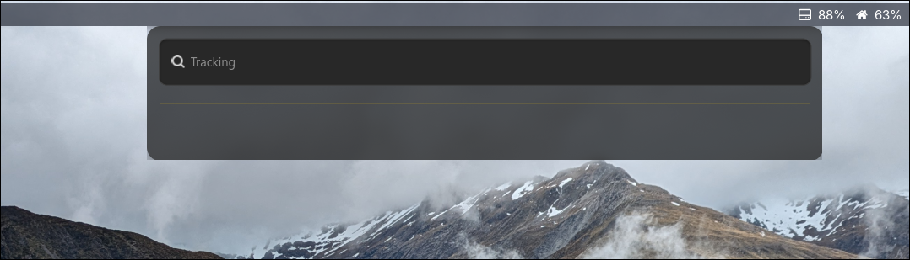
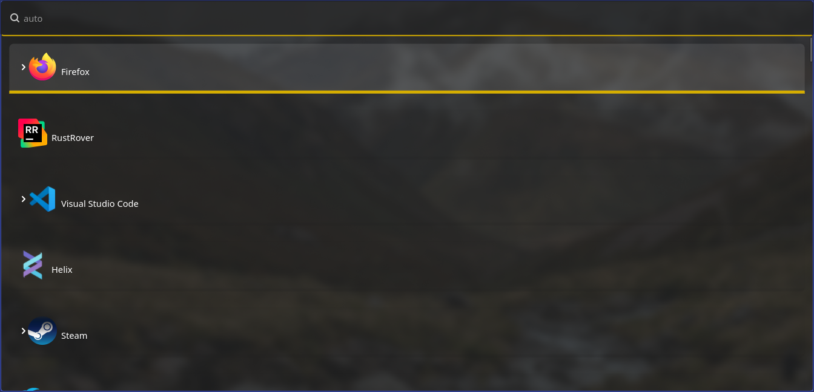

# 🚀 Worf - Wayland Optimized Run Facilitator

> 🎯 Application launcher for Wayland, written in Rust with GTK4

[](https://www.rust-lang.org/)
[](https://gtk.org/)
[](https://wayland.freedesktop.org/)

---

## ✨ Features

Worf is yet another style launcher, heavily inspired by **wofi**, **rofi**, and **walker**. Built from the ground up with Rust and GTK4, it offers exceptional performance and modern styling capabilities.

### 🎪 Multiple Modes Support

- 🧮 **Math** - Including binary/hex conversion and bitwise operations (`&`, `|`, `^`, `<<`, `>>`)
- 🚀 **DRun** - Desktop application launcher
- 📁 **File** - File browser and launcher
- 🖥️E **SSH** - Quick SSH connection launcher
- ⚡ **Run** - Command execution
- 😊 **Emoji** - Emoji picker
- 🔍 **Web Search** - Quick web searches
- 🤖 **Auto** - Intelligent mode detection

### 🧠 Smart Auto Mode

Auto mode intelligently detects what you're trying to do! Use these prefixes for quick access:

| Prefix        | Mode       | Description                          |
|---------------|------------|--------------------------------------|
| `ssh`         | SSH        | Connect to servers (optional prefix) |
| `?`           | Web Search | Search the web                       |
| `/`, `$`, `~` | Files      | Browse filesystem                    |


---

## 🎨 Styling & Theming

Styling is **wofi-compatible** with enhanced GTK4 features! Customize every aspect of your launcher.

### 🏷️ Available Selectors

| Selector                | Description                   |
|-------------------------|-------------------------------|
| `window`                | Main application window       |
| `outer-box`             | Container for all elements    |
| `input`                 | Search input field            |
| `scroll`                | Scrollable results container  |
| `inner-box`             | Menu entries container        |
| `entry`                 | Individual result entry       |
| `text`                  | Entry text content            |
| `img`                   | Entry icons                   |
| `row`                   | Entry row (for hover effects) |
| `custom-key-label-text` | Custom key labels             |
| `custom-key-label-box`  | Custom key label container    |
| `custom-key-hint-text`  | Custom key hints              |
| `custom-key-hint-box`   | Custom key hint container     |

---

## ⚙️ Setup

### ⚒️ Dependencies

* GTK4
* Wayland
* GTK4 layer shell

#### Arch

```bash
sudo pacman -S gtk4 gtk4-layer-shell
```

#### Ubuntu
Ubuntu does not ship gtk4-layer-shell in a supported version. 
Therefore it must be build manually

```bash
sudo apt install -y librust-gdk4-sys-dev \
    libglib2.0-dev libgtk-layer-shell-dev libgtk-layer-shell0 gir1.2-gtklayershell-0.1 \
    libgtk-4-dev gobject-introspection libgirepository1.0-dev gtk-doc-tools python3 valac \
    git cmake gcc meson ninja-build
    
cd /tmp
git clone https://github.com/wmww/gtk4-layer-shell
cd gtk4-layer-shell
meson setup -Dexamples=true -Ddocs=true -Dtests=true build
ninja -C build
sudo ninja -C build install
sudo ldconfig
```


### 🌊 Hyprland Integration

Enable beautiful blur effects for Worf:

```bash
layerrule = blur, worf
```

---

## 📚 Library Usage

🔧 **Developer-Friendly**: Worfs launcher and UI components are available as a separate crate for building custom launchers.

> ⚠️ **Note**: The library API is currently in development and not yet available on crates.io.

---

## 🎯 Examples & Use Cases

The possibilities are endless! Here are some powerful examples of what you can build with Worf:

### worf-hyprland-exit
*Full-screen exit menu for Hyprland*


- Full screen exit menu
- Desktop hiding with background display
- Uses launcher theme styling
- Shell script using dmenu mode

### worf-hyprswitch
*Elegant window switcher*


- Advanced window selector
- Written in Rust using Worf API

### 🔐 worf-warden
*Beautiful Bitwarden frontend*


- Bitwarden integration via [rbw](https://github.com/doy/rbw)
- Additional dependencies required ([see readme](examples/worf-warden/Readme.md))
- Showcasing GlacierPrism theme
- Written in Rust using Worf API

### worf-rtw
*Time tracking made simple*



- Time tracking with [rtw](https://github.com/PicoJr/rtw)
- Using AmberNight theme with custom positioning
- Bash script using dmenu

---

## 🔄 Wofi Migration Guide

### ✅ What's Compatible

- **Themes**: Mostly compatible with existing wofi themes
- **Selectors**: Same entity IDs for easy migration
- **Core Functionality**: Similar behavior and features

### ⚠️ Breaking Changes

- Runtime behaviour is not guaranteed to be the same and won't ever be, this includes error messages and themes.
- Themes in general are mostly compatible. Worf is using the same entity ids, because worf is build on GTK4 instead of GTK3 there will be differences in the look and feel.
- Configuration files are not 100% compatible, Worf is using toml files instead, for most part this only means strings have to be quoted
- Color files are not supported
- line_wrap is now called line-wrap
- Wofi has a C-API, that is not and won't be supported, but Worf can be used as a rust library.
- Most boolean options now need true or false as argument, as Worf is using the same struct for config and command line arguments and this is the only way to merge both data sources
- Removed x,y offset and global coords as GTK4 does not support this anymore, similar results can be achieved with `--location`
- Removed copy_exec as we are not executing a binary to copy data into the clipboard
- `exec-search` not supported

#### Removed Command Line Arguments
- `mode` → Use `show` instead
- `dmenu` → Use `show` instead
- `D` → Arguments = config now
- `dark` → Auto-detected from theme
- `filter-rate` → No longer needed, Worf is fast enough

#### Removed configuration Options
- `stylesheet` → Use `style` instead
- `color`/`colors` → Use GTK4 CSS instead

---

## 🤝 Contributing

Found a compatibility issue? We welcome feedback and contributions! While 100% wofi compatibility isn't guaranteed, we're happy to help you transition to Worf.


## Styles

The background image used for all screenshots can be found in `images/background.jpg` and is taken in Arthurs Pass New Zealand.

### Dmenu


### Launcher


### Compact


### IndigoEdge


### Emoji


### GlacierPrism


### Math


### AmberNight


### Relaxed

                                          
### DarkBlue


---

## 📄 License

GPL V3, see [Copying](COPYING.md)                      

---

<div align="center">

**Made with ❤️ and 🦀**

*Star ⭐ this repo if you find it useful!*

</div>
