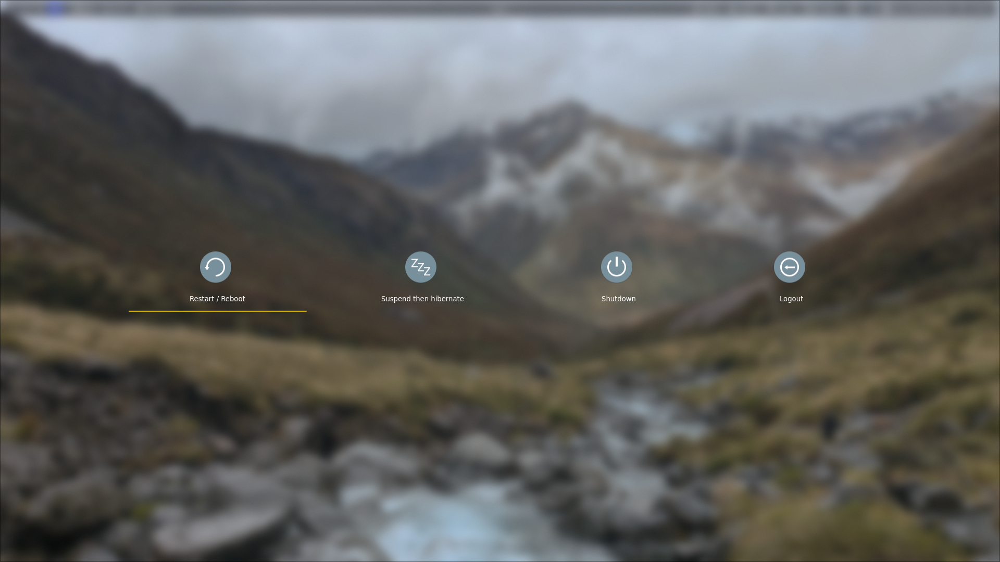
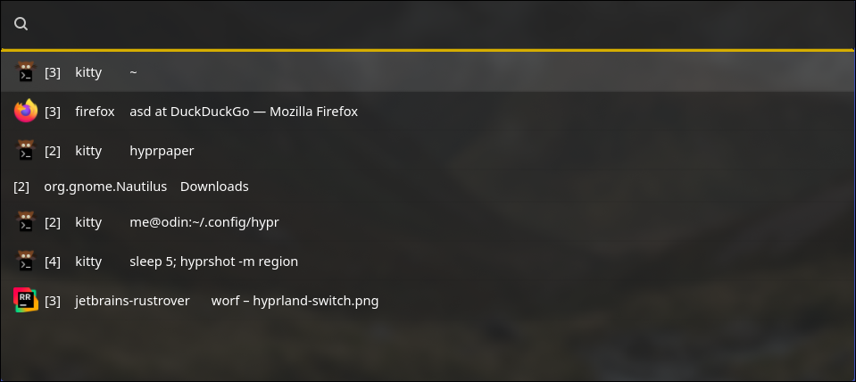

# 🚀 Worf - Wayland Optimized Run Facilitator

> 🎯 Application launcher for Wayland, written in Rust with GTK4

[](https://www.rust-lang.org/)
[](https://gtk.org/)
[](https://wayland.freedesktop.org/)

---

## ✨ Features

Worf is yet another style launcher, heavily inspired by **wofi**, **rofi**, and **walker**. Built from the ground up with Rust and GTK4, it offers exceptional performance and modern styling capabilities.

### 🎪 Multiple Modes Support

- 🧮 **Math** - Including binary/hex conversion and bitwise operations (`&`, `|`, `^`, `<<`, `>>`)
- 🚀 **DRun** - Desktop application launcher
- 📁 **File** - File browser and launcher
- 🖥️E **SSH** - Quick SSH connection launcher
- ⚡ **Run** - Command execution
- 😊 **Emoji** - Emoji picker
- 🔍 **Web Search** - Quick web searches
- 🤖 **Auto** - Intelligent mode detection

### 🧠 Smart Auto Mode

Auto mode intelligently detects what you're trying to do! Use these prefixes for quick access:

| Prefix | Mode | Description |
|--------|------|-------------|
| `ssh` | SSH | Connect to servers (optional prefix) |
| `?` | Web Search | Search the web |
| `/`, `$`, `~` | Files | Browse filesystem |


---

## 🎨 Styling & Theming

Styling is **wofi-compatible** with enhanced GTK4 features! Customize every aspect of your launcher.

### 🏷️ Available Selectors

| Selector                | Description                   |
|-------------------------|-------------------------------|
| `window`                | Main application window       |
| `outer-box`             | Container for all elements    |
| `input`                 | Search input field            |
| `scroll`                | Scrollable results container  |
| `inner-box`             | Menu entries container        |
| `entry`                 | Individual result entry       |
| `text`                  | Entry text content            |
| `img`                   | Entry icons                   |
| `row`                   | Entry row (for hover effects) |
| `custom-key-label-text` | Custom key labels             |
| `custom-key-label-box`  | Custom key label container    |
| `custom-key-hint-text`  | Custom key hints              |
| `custom-key-hint-box`   | Custom key hint container     |

---

## ⚙️ Setup

### 🌊 Hyprland Integration

Enable beautiful blur effects for Worf:

```bash
layerrule = blur, worf
```

---

## 📚 Library Usage

🔧 **Developer-Friendly**: Worf's launcher and UI components are available as a separate crate for building custom launchers.

> ⚠️ **Note**: The library API is currently in development and not yet available on crates.io.

---

## 🎯 Examples & Use Cases

The possibilities are endless! Here are some powerful examples of what you can build with Worf:

### worf-hyprland-exit
*Full-screen exit menu for Hyprland*



- Full screen exit menu
- Shell script using dmenu mode
- Desktop hiding with background display
- Uses launcher theme styling

### worf-hyprswitch
*Elegant window switcher*



- Advanced window selector
- Written in Rust using Worf API
- Featuring AmberNight theme with centered content

### 🔐 worf-warden
*Beautiful Bitwarden frontend*


- Bitwarden integration via [rbw](https://github.com/doy/rbw)
- Additional dependencies required ([see readme](examples/worf-warden/Readme.md))
- Showcasing GlacierPrism theme with blurred background

### worf-rtw
*Time tracking made simple*


- Time tracking with [rtw](https://github.com/PicoJr/rtw)
- Using AmberNight theme with custom positioning

---

## 🔄 Wofi Migration Guide

### ✅ What's Compatible

- **Themes**: Mostly compatible with existing wofi themes
- **Selectors**: Same entity IDs for easy migration
- **Core Functionality**: Similar behavior and features

### ⚠️ Breaking Changes

| Area         | Change                           |
|--------------|----------------------------------|
| **Runtime**  | Behavior differences             |
| **Themes**   | GTK4 vs GTK3 differences         |
| **Config**   | TOML format (quoted strings)     |
| **Colors**   | Color files not supported        |
| **Options**  | line_wrap` → `line-wrap`         |
| **API**      | Rust library only                |
| **Booleans** | Explicit `true`/`false` required |

### 🗑️ Removed Features

#### Command Line Arguments
- `mode` → Use `show` instead
- `dmenu` → Use `show` instead
- `D` → Arguments = config now
- `dark` → Auto-detected from theme
- `filter-rate` → No longer needed, Worf is fast enough

#### Configuration Options
- `stylesheet` → Use `style` instead
- `color`/`colors` → Use GTK4 CSS instead

---

## 🤝 Contributing

Found a compatibility issue? We welcome feedback and contributions! While 100% wofi compatibility isn't guaranteed, we're happy to help you transition to Worf.

---

## 📄 License

GPL V3, see [Copying](COPYING.md)                      

---

<div align="center">

**Made with ❤️ and 🦀**

*Star ⭐ this repo if you find it useful!*

</div>
