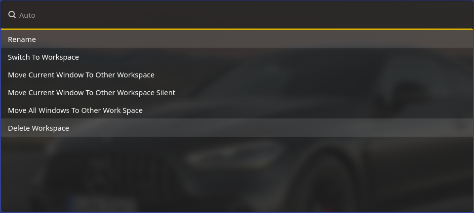

# Worf Hyprspace

This allows to manage workspaces in hyprland using the Worf API.
Inspired by https://github.com/sslater11/hyprland-dynamic-workspaces-manager

## Features
-Auto: Automatic detection of mode
-Rename: Change the name of the chosen workspace
-SwitchToWorkspace: Change the active workspace
-MoveCurrentWindowToOtherWorkspace: Move the focused window to a new workspace and follow it
-MoveCurrentWindowToOtherWorkspaceSilent: Move the focused window to a new workspace and don't follow it  
-MoveAllWindowsToOtherWorkSpace: Move all windows to a new workspace
-DeleteWorkspace: Close all windows and go to another workspace
