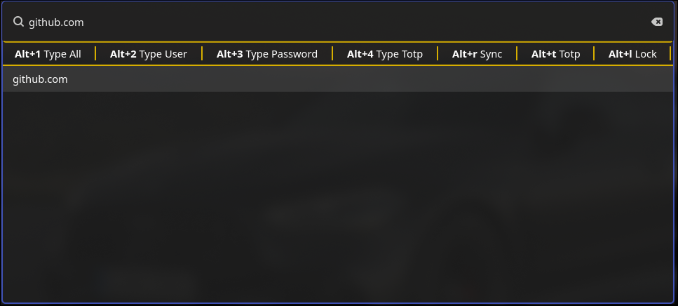

# Worf Warden

Simple password manager build upon these additional tools aside worf
* [rbw](https://github.com/doy/rbw)
  * TOTP needs [this PR ](https://github.com/doy/rbw/pull/247) 
  * [pinentry](https://www.gnupg.org/related_software/pinentry/index.en.html) is required to show a dialog show password entry 
  * As worf warden 
* [ydotool](https://github.com/ReimuNotMoe/ydotool)

The idea it taken from https://github.com/mattydebie/bitwarden-rofi/blob/master/bwmenu

