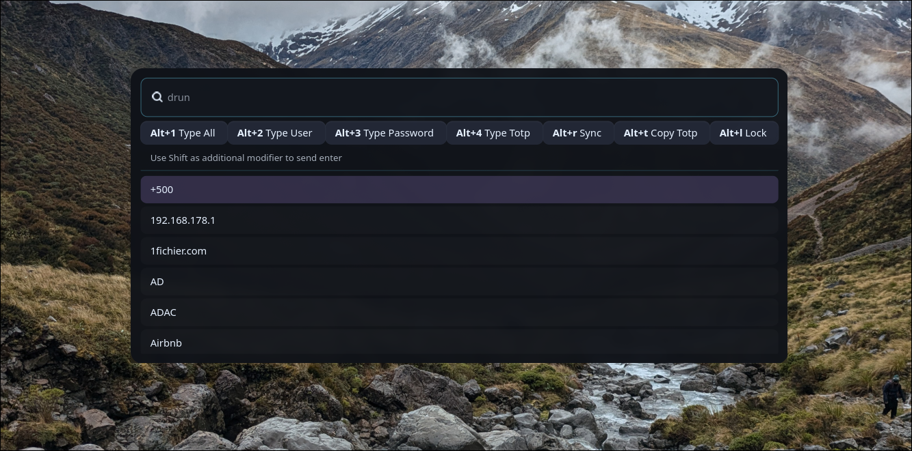

# Worf Warden

Simple password manager build upon these additional tools aside worf
* [rbw](https://github.com/doy/rbw) 
* 
  * [pinentry](https://www.gnupg.org/related_software/pinentry/index.en.html) is required to show a dialog show password entry 
  * As worf warden 
* [ydotool](https://github.com/ReimuNotMoe/ydotool)

The idea it taken from https://github.com/mattydebie/bitwarden-rofi/blob/master/bwmenu

## Custom auto typing
* Auto typing supports custom keys. Just pass user name with `$U` and pw with `$P`
  * I.e. the default is `$U\t$P` which is user, tab, password. 
  * This is using ydotool to type, so see their documentation for key input details.

### Example
`~/.config/worf/warden`

```toml
[custom_auto_types]
# This will use User, enter, password for the demo entry.
# You can use the id or the label as key, where id has higher precedence.
Demo = "$U\n$P"
# Will sleep 500ms before typing password
# Any underscore will be ignored
Delayed = "$U_\n_$S_500_$P"
```



